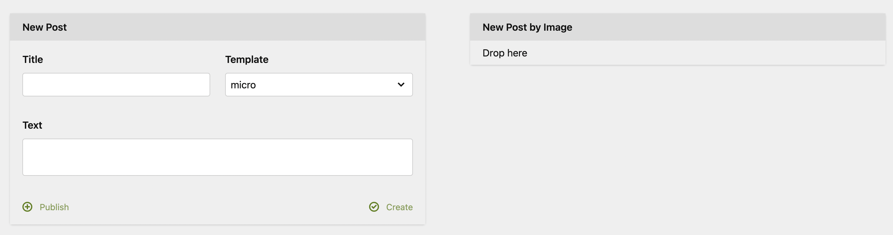

# Kirby Quick Add Plugin

This plugin provides a two panel section that provides a form to quickly add a new child page to a pre defined
page structure. Initially it was build to quickly create new blog posts without having to navigate the page tree
to the correct directory (e.g. `blog/posts/[current year]`).

Please consider this plugin as a show case how to build a simple custom section and not as full fledged and extremely
customizable plugin. It's mainly built for my blog and just published because I wanted to write a post about it 🤪




## Installation

1. `composer require pwaldhauer/kirby-quick-add` or copy the files to the `site/plugins` folder.
2. Add the section to a blueprint:

```
sections:
  quickAdd:
    type: quickadd
    headline: New Post
    target: posts/[YEAR]
    defaultTemplate: micro
    templates:
      - micro
      - short
      - long
```

or

```
sections:
  quickAdd:
    type: quickaddimage
    headline: New Post
    target: posts/[YEAR]
    template: micro
    text: Drop here
    dragText: "(image:[FILENAME] size:big)"
```

(or combine both with a `colums` thingy)

## Blueprint options (quickadd)

- `headline`: Printed above the section
- `target`: The path to the page the new one will be a child of. `[YEAR]` will be replaced with the current year (e.g. 2020).
- `templates`: List of possible templates
- `defaultTemplate`: Default template 

## Blueprint options (quickaddimage)

- `headline`: Printed above the section
- `text`: Printed in the drop zone
- `dragText`: The KirbyTag that will be inserted into the post for every file
- `target`: The path to the page the new one will be a child of. `[YEAR]` will be replaced with the current year (e.g. 2020).
- `template`: Default template for the created post


## License

MIT
